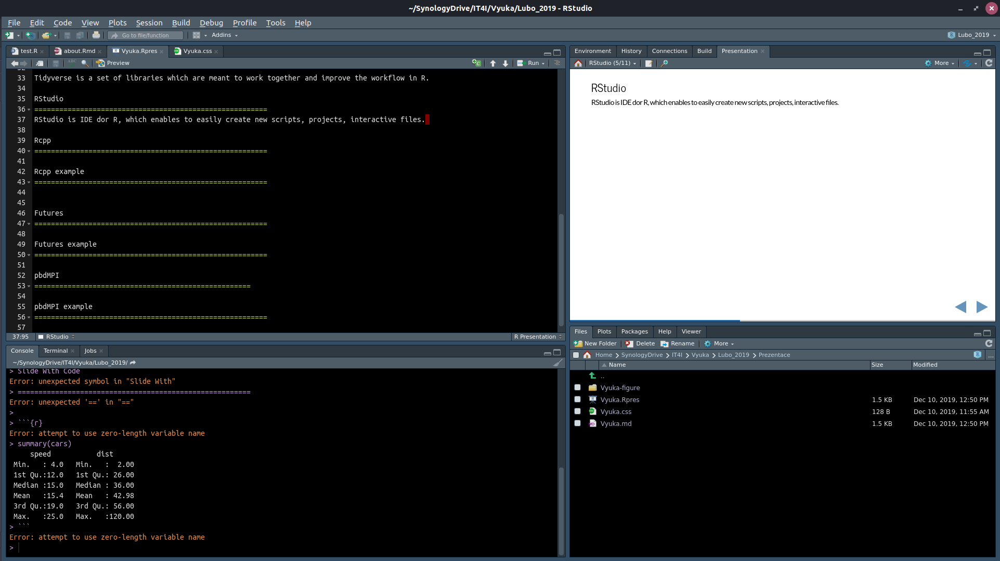
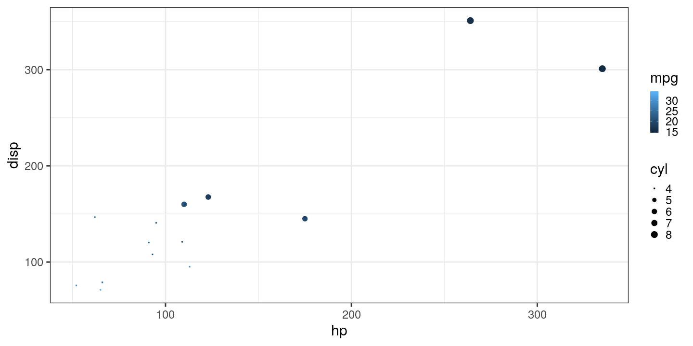

R in HPC environment
========================================================
author: Tomáš Martinovič
css: Vyuka.css
date: 11.12.2019
autosize: true
font-family: 'serif'
height: 1080
width:1920
#font-import: http://fonts.googleapis.com/css?family=Risque
#font-family: 'Risque'

What is R?
========================================================
left: 70%
R is statistical language based on the S language.

It is focused on the data analysis, but can be used for other things now.
Among these are GIS applications, mathematical analysis and such.

***


Characteristics of R
========================================================
class:vert_center

- **Functional programming**
- data are immutable
- Easy to use and learn (for non-programmers)
- Great flexibility
- Large user base
- Enormous number of packages available in different fields
- Can be slow and memory inefficient (but many function are actually written in C)
- No direct memory control - garbage collector

RStudio
========================================================
RStudio is IDE dor R, which enables to easily create new scripts, projects, interactive files.

<!--  -->

R basics
=======================================================

```r
# Comments are written with "#"
library(tidyverse) # loading library "tidyverse"
tbl_mtcars <- as_tibble(mtcars) # we can assign an object with "<-" not "=" as you might be used to
tbl_mtcars # writing only the variable will do  default action for it, usually print() or equivalent
```

```
# A tibble: 32 x 11
     mpg   cyl  disp    hp  drat    wt  qsec    vs    am  gear  carb
   <dbl> <dbl> <dbl> <dbl> <dbl> <dbl> <dbl> <dbl> <dbl> <dbl> <dbl>
 1  21       6  160    110  3.9   2.62  16.5     0     1     4     4
 2  21       6  160    110  3.9   2.88  17.0     0     1     4     4
 3  22.8     4  108     93  3.85  2.32  18.6     1     1     4     1
 4  21.4     6  258    110  3.08  3.22  19.4     1     0     3     1
 5  18.7     8  360    175  3.15  3.44  17.0     0     0     3     2
 6  18.1     6  225    105  2.76  3.46  20.2     1     0     3     1
 7  14.3     8  360    245  3.21  3.57  15.8     0     0     3     4
 8  24.4     4  147.    62  3.69  3.19  20       1     0     4     2
 9  22.8     4  141.    95  3.92  3.15  22.9     1     0     4     2
10  19.2     6  168.   123  3.92  3.44  18.3     1     0     4     4
# … with 22 more rows
```
- tbl_mtcars is a tibble, which is special format of data.frame
- tibbles are basic object in which are stored data in R
- it is a special list which contains object with equal length
- each column may have different class

R as a functional language
=======================================================

```r
x <- 2  # 2 is assigned to x
add_3 <- function(y){
  cat( "The value of x is ", x, "\n") # It will print x from global environment
  x <- 3   # The x is defined inside the function, this does not affect x in global environment
  y + x    # Local x is added to y
}
add_3(3) 
```

```
The value of x is  2 
```

```
[1] 6
```

```r
x # See that global x was not affected by the assignment inside the function.
```

```
[1] 2
```

R as a functional language
=======================================================

```r
# It is possible to nest function into function
add_3(add_3(3))
```

```
The value of x is  2 
The value of x is  2 
```

```
[1] 9
```
- Actually, R will let you write incredibly complicated nested statements.
- That does not mean all of it is good.

Tidyverse
========================================================

Tidyverse is a set of libraries which are meant to work together and improve the workflow in R.

### Core packages
<table class="myTable table" style="font-size: 40px; margin-left: auto; margin-right: auto;">
 <thead>
  <tr>
   <th style="text-align:left;background-color: #bbb !important;font-size: 40px;"> Package </th>
   <th style="text-align:left;background-color: #bbb !important;font-size: 40px;"> Purpose </th>
  </tr>
 </thead>
<tbody>
  <tr>
   <td style="text-align:left;background-color: #eee !important;"> readr </td>
   <td style="text-align:left;background-color: #eee !important;"> reading table data </td>
  </tr>
  <tr>
   <td style="text-align:left;"> tidyr </td>
   <td style="text-align:left;"> data preparation </td>
  </tr>
  <tr>
   <td style="text-align:left;background-color: #eee !important;"> dplyr </td>
   <td style="text-align:left;background-color: #eee !important;"> data analysis </td>
  </tr>
  <tr>
   <td style="text-align:left;"> ggplot2 </td>
   <td style="text-align:left;"> visualization </td>
  </tr>
  <tr>
   <td style="text-align:left;background-color: #eee !important;"> purrr </td>
   <td style="text-align:left;background-color: #eee !important;"> iteration functions </td>
  </tr>
  <tr>
   <td style="text-align:left;"> tibble </td>
   <td style="text-align:left;"> special data frame </td>
  </tr>
  <tr>
   <td style="text-align:left;background-color: #eee !important;"> stringr </td>
   <td style="text-align:left;background-color: #eee !important;"> text operations </td>
  </tr>
  <tr>
   <td style="text-align:left;"> forcats </td>
   <td style="text-align:left;"> factor operations </td>
  </tr>
</tbody>
</table>
Read more at https://www.tidyverse.org/.

R with tidyverse syntax
========================================================

```r
tbl_mtcars %>%                 # pipes, %>%, connect multiple operations  
  filter(cyl == 4, carb == 2) %>%  # filter cyl and carb
  select(mpg, disp, hp, drat, wt, qsec) # select columns
```

```
# A tibble: 6 x 6
    mpg  disp    hp  drat    wt  qsec
  <dbl> <dbl> <dbl> <dbl> <dbl> <dbl>
1  24.4 147.     62  3.69  3.19  20  
2  22.8 141.     95  3.92  3.15  22.9
3  30.4  75.7    52  4.93  1.62  18.5
4  26   120.     91  4.43  2.14  16.7
5  30.4  95.1   113  3.77  1.51  16.9
6  21.4 121     109  4.11  2.78  18.6
```

```r
tbl_mtcars %>%
  group_by(cyl) %>%
  summarize(n = n(), # n() return number of rows in group
            unique_carb = n_distinct(carb),
            min_mpg = min(mpg),
            max_mpg = max(mpg))
```

```
# A tibble: 3 x 5
    cyl     n unique_carb min_mpg max_mpg
  <dbl> <int>       <int>   <dbl>   <dbl>
1     4    11           2    21.4    33.9
2     6     7           3    17.8    21.4
3     8    14           4    10.4    19.2
```

ggplot2 visualization
=======================================================

```r
theme_set(theme_bw(base_size = 30))
tbl_mtcars %>%
  filter(gear > 3) %>%
  ggplot(aes(x = hp, y = disp, color = mpg, size = cyl)) +
    geom_point()
```



Rcpp
========================================================
Rcpp is a package used to easily use C++ function in R.
You can install it by executing `install.packages("Rcpp")` in R console.

- Rcpp is now most used way to link C++ and R code in the package creation.
- It uses comments (something like) C++ files to let the compiler know the function should be exported to R.
- It also has libraries which allows to use R statements in C++.

You can read more about it in

https://cran.r-project.org/web/packages/Rcpp/vignettes/Rcpp-introduction.pdf

https://cran.r-project.org/web/packages/Rcpp/.

In this course we will just show how to use function `cppFunction()` to get a C function exported to R from a string right in the R script.

### Main advantages
- No need to write separate C++ file.
- *Rcpp* will take care of the compiling, linking and exporting of the function to R.

Rcpp rolling mean example
========================================================

```r
library(Rcpp)

myrollmean <- cppFunction('
  NumericVector myrollmean( NumericVector x, double width) {
    double temp = 0;
    unsigned int n = x.size(), i, counter = 0;
    NumericVector out(n - width + 1);
    
    for(i = 0; i < width; i++) {
      temp += x[i];
    }
    
    out[0] = temp / width;
    counter += 1;
    
    for( i = width; i < n; i++ ) {
      temp = temp - x[i - width] + x[i];
      out[counter] = temp / width;
      counter += 1;
    }
    
    return out;
  }')
```

Rcpp rolling mean example continue
=========================================================

```r
library(zoo)
library(microbenchmark)

vec <- 1:10000
width <- 1000

res_r <- rollmean(vec, width)
res_c <- myrollmean(vec, width)

identical(res_r, res_c)

microbenchmark(rollmean(vec, width),
               myrollmean(vec, width))
```

```
[1] TRUE
```

```
Unit: microseconds
 expr      min       lq       mean   median        uq      max neval
    R 4683.910 5097.739 5524.95033 5276.126 5455.9380 9181.669   100
    C   58.903   62.404   90.62887   67.001   75.8645 1611.412   100
```

furrr
========================================================
It is a package for parallel evaluation based on the packages `future`.
It takes map functions from `purrr` package and transform them into futures, effectively allowing for the parallel run of the map functions.


```r
library(furrr)

plan(multiprocess)
boot_df <- function(x) x[sample(nrow(x), replace = T), ]
rsquared <- function(mod) summary(mod)$r.squared
boot_lm <- function(i) {
  rsquared(lm(mpg ~ wt + disp, data = boot_df(mtcars)))
}

res <- microbenchmark(map(1:500, boot_lm),
               future_map(1:500, boot_lm),
               parallel::mclapply(1:500, boot_lm, mc.cores = 6),
               times = 50)
res
autoplot(res)
```
There is trouble with using futures in RStudio. Therefore, the evaluation is turned off for this chunk.

pbdMPI
====================================================
It is a package for usage of MPI functions inside R.
Prerequisities are having mpi installed.
It supports Open MPI, Intel MPI and MPICH2.

This is done by using configure.args when using R console, or with argument "R CMD INSTALL pbdMPI --with-mpi-version=OPENMPI" in command line.

```r
install.packages("pbdMPI", configure.args = "--with-mpi-version=OPENMPI")
```
Then R script should call library pbdMPI and then contain `init()` and `finalize()` functions similar to normal MPI usage and is run in command line using `mpiexec RScript path_to_script.R`.

```r
library(pbdMPI)
library(tidyverse)

init()
random <- map(rep(4e5, 50), rnorm)
id <- get.jid(length(random))

local <- random[id]
temp <- map(local, mean)

result <- gather(temp)
finalize()
```
